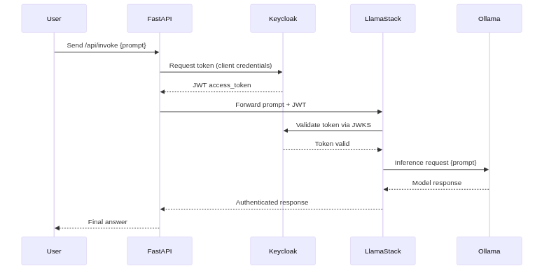

### 📄 `MODULE2.md`

# Module 2 — OAuth + Llama Stack Flow

In this module, we extend the basic OAuth flow from **Module 1** by introducing **Llama Stack**.  
Instead of FastAPI calling Ollama directly, FastAPI now talks to Llama Stack.  
Llama Stack enforces **Keycloak authentication** and forwards valid requests to Ollama for inference.  


## 🔎 Breakdown

From Module 1:
- FastAPI obtained a JWT from Keycloak.
- FastAPI sent the token + prompt directly to Ollama.

In Module 2:
- We introduced **Llama Stack** .  
- FastAPI now sends token + prompt to **Llama Stack**.  
- Llama Stack:
  1. Validates the JWT against **Keycloak**.  
  2. Forwards the prompt to **Ollama** only if authentication succeeds.  
  3. Returns the response back through FastAPI to the user.  

At this stage, **no tool calls are made** — only plain text inference through a secure OAuth flow.




## ⚙️ Config Changes

### 1. `.env` update
Point FastAPI to Llama Stack instead of Ollama:

```env
# Llama Stack
LLS_BASE_URL=http://localhost:8321
LLS_CHAT_ENDPOINT=/v1/inference/chat-completion
```

### 2. Configure run.yaml 

```shell
version: 2
image_name: starter

apis:
  - inference

providers:
  inference:
    - provider_id: ollama
      provider_type: remote::ollama
      config:
        url: ${env.OLLAMA_URL:=http://host.containers.internal:11434}

models:
  - model_id: ${env.INFERENCE_MODEL:=llama3.2:3b}
    provider_id: ollama
    provider_model_id: ${env.INFERENCE_MODEL:=llama3.2:3b}
    metadata: {}

server:
  port: ${env.LLAMA_STACK_PORT:=8321}
  auth:
    provider_config:
      type: oauth2_token
      jwks:
        uri: ${env.KEYCLOAK_JWKS_URI:=http://localhost:8080/realms/lls-auth/protocol/openid-connect/certs}
      issuer: ${env.KEYCLOAK_ISSUER:=http://localhost:8080/realms/lls-auth}
      audience: ${env.KEYCLOAK_AUDIENCE:=lls-client}
```

## 🚀 Setup

### Run Ollama

Make sure Ollama is serving the model:

```shell
ollama run llama3.2:3b --keepalive 180m
```

### Run Llama Stack

Use `uv` to build and run Llama Stack with your config:

```shell
OLLAMA_URL=http://localhost:11434 uv run --with llama-stack llama stack build --distro starter --image-type venv --run --config configs/run.yaml 
```

This starts Llama Stack on `http://localhost:8321`

### Run FastAPI

In a separate terminal:

```shell
uvicorn lls_auth_client.main:app --reload
```

### Verify FastAPI → Llama Stack → Ollama

```shell
# With curl
TOKEN=$(python -c "from lls_auth_client.auth import keycloak_auth; print(keycloak_auth.get_token())")

curl -s -X POST "http://localhost:8321/v1/inference/chat-completion" \
  -H "Authorization: Bearer $TOKEN" \
  -H "Content-Type: application/json" \
  -d '{"model_id":"llama3.2:3b","messages":[{"role":"user","content":"Hello from Llama Stack!"}]}'

# With FastApi

curl -X POST http://127.0.0.1:8000/api/invoke \
  -H "Content-Type: application/json" \
  -d '{"prompt": "Who are you?"}'
```


## 📚 Next
In the next module, you will extend the flow with **tool calls via MCP**, allowing the model to invoke external tools in addition to plain text inference.

- ➡️  [Go to Module 3](MODULE3.md)  
- ⬅️ [Back to Module 1](MODULE1.md)  
- ⬆️ [Back to README](../README.md)

